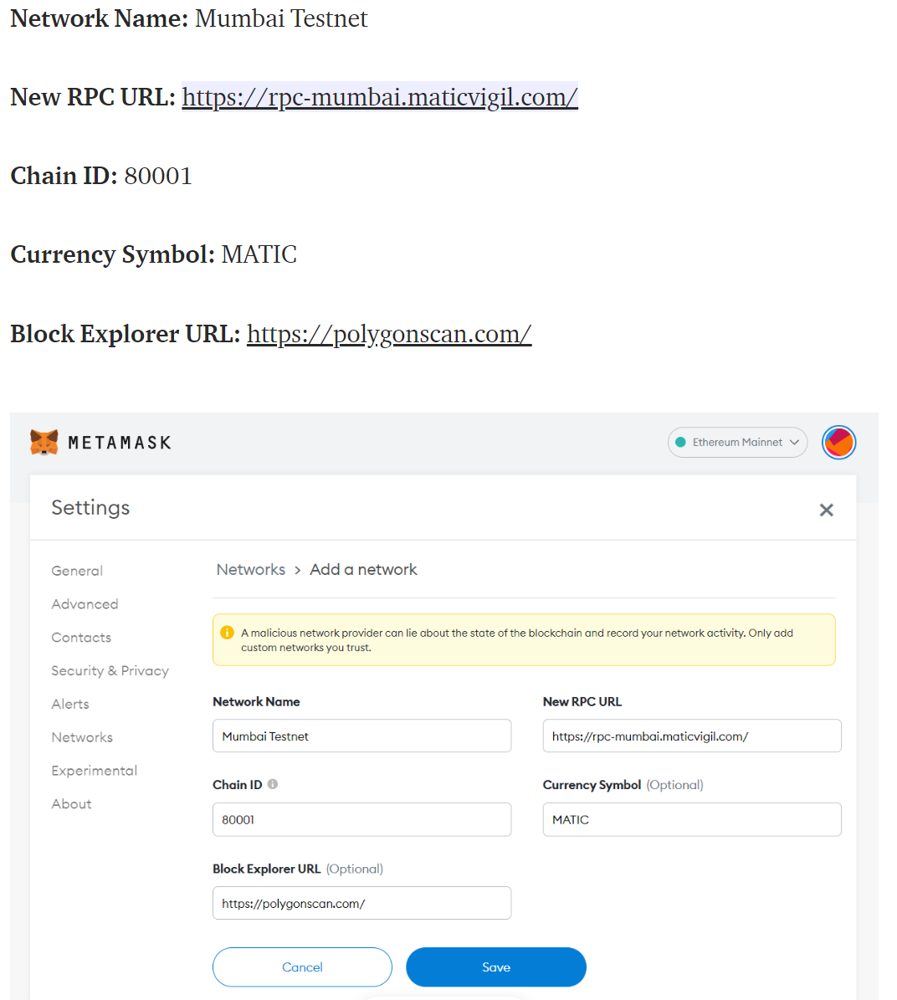

Made by <a href="https://github.com/HashRei">@HashRei</a>

# Getting Started

## Requirements

- [git](https://git-scm.com/book/en/v2/Getting-Started-Installing-Git)
  - You'll know you did it right if you can run `git --version` and you see a response like `git version x.x.x`
- [Nodejs & npm](https://nodejs.org/en/)
  - You'll know you've installed nodejs right if you can run:
    - `node --version` And get an ouput like: `vx.x.x`
  - You'll know you've installed npx right if you can run:
    - `npm --version` And get an ouput like: `x.x.x`
- [Yarn](https://classic.yarnpkg.com/lang/en/docs/install/) instead of `npm`
  - You'll know you've installed yarn right if you can run:
    - `yarn --version` And get an output like: `x.x.x`
    - You might need to install it with npm
- [Metamask](https://metamask.io/)
  - This is a browser extension that lets you interact with the blockchain.
- A Testnet Mumbai project [Alchemy URL](https://alchemy.com/?a=673c802981)

### Build with...
  
  
  
  
  and Hardhat.

## Quickstart

1. Clone and install dependencies

```
git clone https://github.com/HashRei/nft-marketplace.git
cd nft-marketplace
yarn
```

2. Run

```
yarn dev
```
3. Add the Mumbai Network to your your wallet

  Easyiest way is to go to https://chainlist.org/, select **Testnets** and write **Mumbai** in the search bar of the website
  
  OR
  

  
4. Get some Testnet Matic

https://faucet.matic.network/

https://testmatic.vercel.app/ (0.2 MATIC per claim)

https://mumbaifaucet.com/ (1 MATIC per claim)


## Deployed version 👇

#

📫 How to contact me: 
[](mailto:hashrei@protonmail.com)
<a href="https://t.me/HashRei_Real" target="_blank">
  
</a> 
<a href="https://twitter.com/HashRei_" target="_blank">
  
</a>

Made by <a href="https://github.com/HashRei">@HashRei</a>
